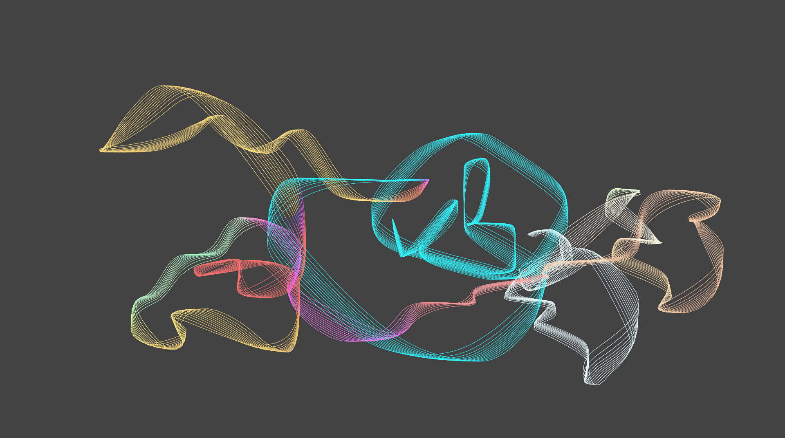

#Tilting

Tilt your phone and draw on your computer. It looks something like this:



#Introduction

[Here](http://tilting.wenchen.li "Rainbow Ribbon - Tilt to Draw") is an up and running version.

It is built with [socket.io](https://github.com/socketio/socket.io/) and [CreateJS](http://createjs.com/).

#Usage

1. Have your phone and computer go to the address that's running this
2. Choose "CONTROL" on your phone and "MONITOR" on your computer
3. Tilt your phone and start drawing!

If you are running this locally (instructions below), please make sure your phone and your computer are under the same network.

#Setup

```Shell
git clone https://github.com/neolwc/tilting.git
cd tilting
npm install
npm start
```

And it will be up and running on ```localhost:3000``` by default.

#Contributing

Welcome to submit an issues, fork and create a pull request.
